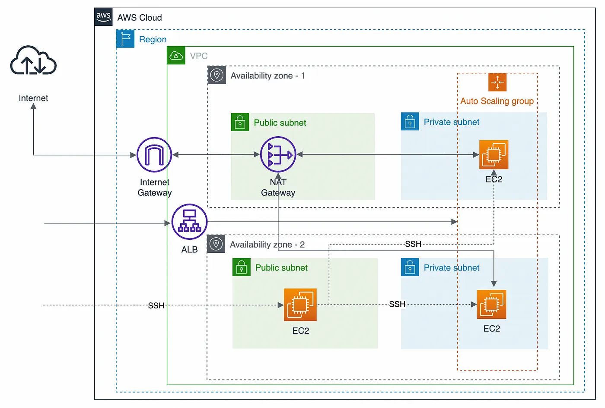
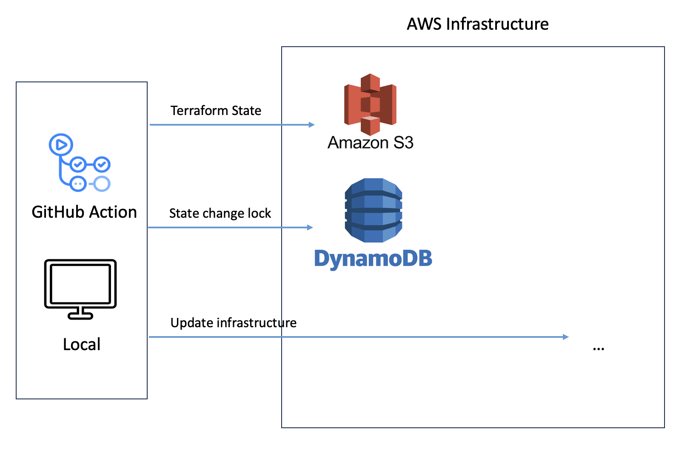
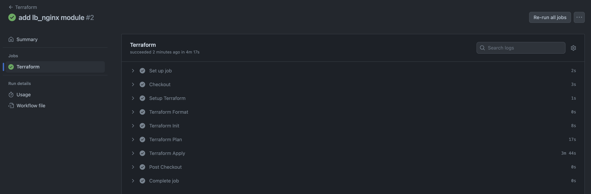
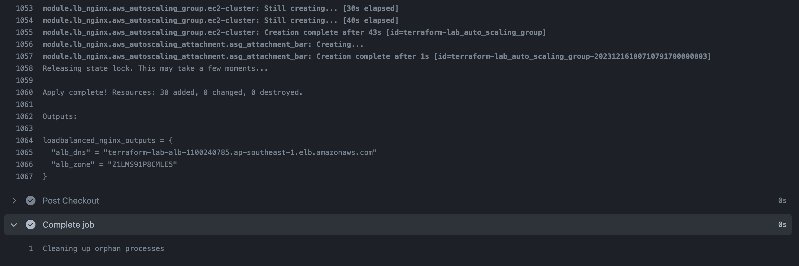

# gt_lb_nginx

## Architecture



## Set up

### Prerequisite
1. Ensure you have installed [terraform](https://developer.hashicorp.com/terraform/install?product_intent=terraform).
2. Ensure you have install [aws-cli](https://docs.aws.amazon.com/cli/latest/userguide/getting-started-install.html) and configured AWS credentials in your machine.
3. Generate your key-pair and populate the hash into `src/modules/lb_nginx/terraform-key-pair.pem`.

#### To use github action to auto apply the terraform, S3 bucket and DynamoDB needs to be created to store terraform state and state-change-lock
When first time running, please commented-out  "backend" block in `src/main.tf`, then init/plan/apply with (ueses local backend) to provision Resources S3 bucket and DynamoDB table.
Then uncomment "backend" and run init, apply after Resources have been created (uses AWS)




### Run without Github Action
Delete or comment out the entire `modules/tf-state` folder.

Run the below to spin up the loadbalanced nginx on aws.
```sh
terraform init
terraform apply  # type yes once reviewed and confirmed
```

Once if the execution is successful, terminal will display the url of the loadbalancer:


Copy and paste the url and open with a browser, you should see nginx is running.


### Clean up

```sh
terraform destroy  # type yes once reviewed and confirmed
```

