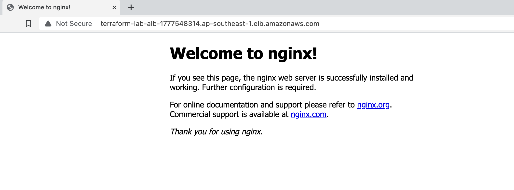

# gt_lb_nginx


## Set up

### Prerequisite
1. Ensure you have installed [terraform](https://developer.hashicorp.com/terraform/install?product_intent=terraform).
2. Ensure you have install [aws-cli](https://docs.aws.amazon.com/cli/latest/userguide/getting-started-install.html) and configured AWS credentials in your machine.


Run the below to spin up the loadbalanced nginx on aws.
```sh
terraform init
terraform apply  # type yes once reviewed and confirmed
```

Once if the execution is successful, terminal will display the url of the loadbalancer:


Copy and paste the url and open with a browser, you should see nginx is running.



### Clean up

```sh
terraform destroy  # type yes once reviewed and confirmed
```

### Github Action for CI pipeline

For every pull request, `terraform plan` command will be run on the Terraform cloud. It will add a comment to the pull request with a link to the run in Terraform Cloud
